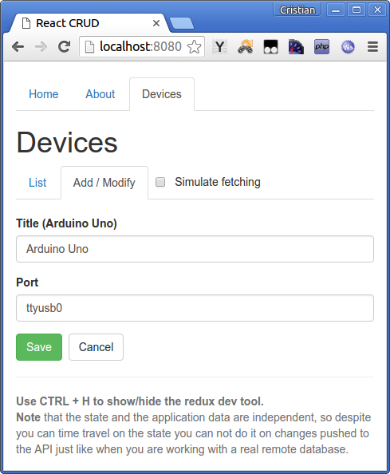
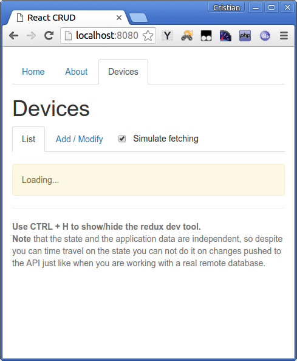

React/Redux basic CRUD example webapp
-------------------------------

This is a little app was made to test the basic CRUD steps on a webpapp. This was done thinking on a mobile or chrome application so this is not using routes.

A separation between the state and the application data is in place to test a more realistic situation where you do async calls to a remote API, something missing on many redux/react examples.

This is being developed while I'm learning about react/redux so the code shared here contains many errors and is not following any particular standard.

**Local Storage**
This uses local storage for two tasks:

- **store the state** ([redux-localstorage](https://github.com/elgerlambert/redux-localstorage))
	this allows the webapp to be reloaded without losing the current state. (so it can be a hosted webapp that when added to IOS home screen does not lose the state each time the user goes away and comes back [stackoverflow](http://stackoverflow.com/questions/6930771/stop-reloading-of-web-app-launched-from-iphone-home-screen))
- **store the CRUD data** ([store.js](https://github.com/marcuswestin/store.js/))
	when actions are dispatched, async calls are executed against a local api that takes care of the data, a delay time is in place so the "fetching" state can be shown.

**Web app**
Can be added to IOS/Andriod home screen and each time is loaded the state remains the same (because the persistent state plugin).

**No routes**
Routes are amazing and are a requirement in many cases but this is a trial to check an alternative way when there is no need to provide bookmarks to sections or server rendering.

**To do**
Learn more and improve this example.

**Use**
```
npm install
npm start
```

Open http://localhost:8080/

**Screens**




**License**
MIT
